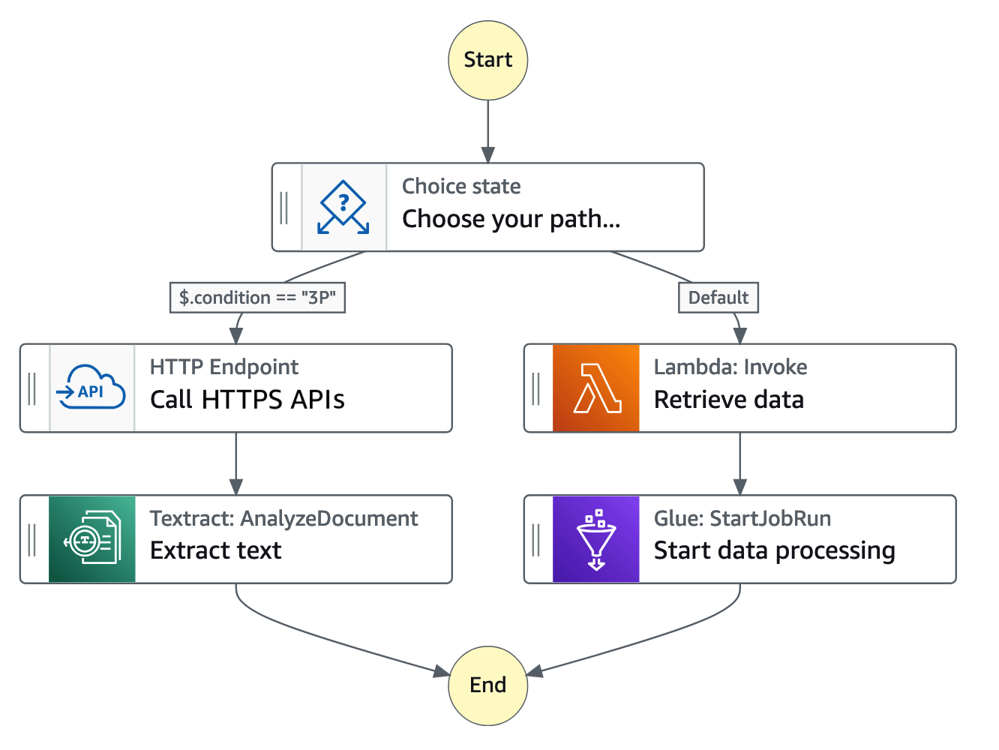

# AI開発の進行管理を、自作ワークフローエンジンに任せてみた

<!-- Phasekeeperという個人的な試作を通して、AIコーディングの実行制御を考えた話です。 -->

---

## 目次

<!--
  - TODO: 発表内容が固まった最後に、章立てをまとめ直す
  - ここは深く説明せず、発表の流れだけ示す
-->

- 人間が担っていたAI開発の進行管理
- Step FunctionsとAI-DLCから得た着想
- 自作ワークフローエンジン「Phasekeeper」
- 状態を外出ししてループを制御する
- 作って見えたこと

---

## 自己紹介

<!--
  - 深く説明しない
  - 名前
  - 業務アプリのバックエンドがメイン
  - Go / DB / AWS あたりに触れる
  - 最後によろしくお願いします
-->

- 名前 えび
- 経歴
  - 2021年9月 入社（現職）
  - エンジニア 5年目
- 技術
  - Open/Web系の業務アプリのバックエンドがメイン
  - 言語,F/W: Go / Laravel / Rails / React.ts
  - DB: MySQL,PostgreSQL
  - クラウド/インフラ: AWS
- 資格
  - 基本情報、AWS SAA、AWS SAP

---

## AIへの指示、何度も繰り返していない？

<!--
  - 早速本題
  - AIに実装を任せても、区切りごとに人間が会話をつないでいる
  - 個々の指示が難しいというより、同じ種類の判断を毎回しているのが気になった
-->

### > 調査して

### > 方針を出して。一度ここで待って

### > 実装して。失敗したら戻って直して

---

## 人間がワークフローエンジンになっていた

<!--
  - 左は実際の作業、右はその外側で人間がしている進行管理
  - AIに作業を任せていても、流れを維持する役は人間のままだった
  - 右側の仕事は会話ではなくコードで扱えるのでは、と考えた
-->

<div style="display: flex; gap: 56px;">
<div style="flex: 1;">

### AI

- 調査
- 方針の作成
- 実装・検証

</div>
<div style="flex: 1;">

### 人間

- 次の作業を指示
- 完了したか確認
- Retry / Stopを判断
- 戻る場所を指定

</div>
</div>

---

## AWS Step Functionsとは

<!--
  - AWSの詳しいサービス紹介はしない

  - 当時、AWS Step Functionsに触れていた
  - LambdaやDynamoDBなどの処理を、状態と遷移でつなげられる
  - 成功・失敗に応じた分岐やRetry、待機もワークフローに定義できる
  - 今回重要なのは、処理を単なる順番ではなく状態遷移として扱う点
-->

<div style="display: flex; gap: 40px; align-items: center;">
<div style="flex: 1;">

複数の処理（Lambda / ECS / Batchなど）を「状態遷移」としてつなぐオーケストレーションサービス。

アプリ本体に分岐・再試行・並列制御を埋め込まず、ワークフローとして分離できるのが強み。

</div>
<div style="flex: 1; text-align: center;">



</div>
</div>

---

## AWSのAI-DLCサンプルとの出会い

<!--
  - その後、AWSのAI-DLCを知った
  - AI-DLC全体をPhasekeeperで実装した、という話ではない
  - sample-aidlc-decisions-driven-skillでは、PhaseごとにAIが作業し、重要な判断では人間が関わる
  - 自分が考えていた進行管理に、Human-in-the-Loopの観点が加わった
  - 図の細かな処理ではなく、AIと人間が交代する境界を見てほしい
-->

```text
AIによる実行 ──> Human Gate ──> 次のPhase
                      │
                 人間が承認・判断
```

**AIによる実行 × 人間による重要な判断**

<small>参考：https://github.com/aws-samples/sample-aidlc-decisions-driven-skill/tree/main/skills/aidlc</small>

---

## あれ？

## この考え方、AI開発の進行管理にも使えるのでは？

---

## 2つの着想を組み合わせる

<!--
  - Step Functionsからは、処理を現在状態と遷移として見る考え方を借りた
  - AI-DLCからは、AIが進めつつ重要な判断で人間が関わる方向性を得た
  - この2つを組み合わせ、AI開発の進行管理を外側に置くことにした
  - 次で、実際に作ったPhasekeeperを紹介する
-->

<div style="display: flex; gap: 32px; margin-top: 12px;">
  <div style="flex: 1; padding: 24px; border: 2px solid #4f86c6; border-radius: 14px; text-align: center;">
    <h3 style="margin-bottom: 16px;">AWS Step Functions</h3>
    <div>状態・遷移</div>
    <div>Retry・待機</div>
  </div>
  <div style="flex: 1; padding: 24px; border: 2px solid #6f9e72; border-radius: 14px; text-align: center;">
    <h3 style="margin-bottom: 16px;">AWS AI-DLC</h3>
    <div>AIによる実行</div>
    <div>人間による重要な判断</div>
  </div>
</div>

<div style="text-align: center; font-size: 48px; line-height: 1; margin: 14px 0;">↓</div>

<div style="padding: 20px; border-radius: 14px; background: #334f6f; color: white; text-align: center; font-size: 34px; font-weight: 700;">
  AI開発の進行管理を、AIの外側へ
</div>

---

## 実際に作ってみた

<!--
  - そこでPhasekeeperという小さなツールをGoで作った
  - Markdownのissueを渡すと、EngineがPhaseごとにCodex CLIを起動する
  - Codexを改造したのではなく、その外側に進行管理を置いている
  - 現状はローカルで動く個人的な試作
-->

<div style="display: flex; align-items: center; gap: 18px; margin-top: 28px;">
  <div style="flex: 0.8; padding: 22px 12px; border: 2px solid #8795a5; border-radius: 14px; text-align: center;">
    <div style="font-size: 36px;">📄</div>
    <strong>Issue.md</strong>
  </div>
  <div style="font-size: 36px; text-align: center;">
    →
  </div>
  <div style="flex: 1.35; padding: 26px 16px; border-radius: 14px; background: #334f6f; color: white; text-align: center;">
    <div style="font-size: 34px; font-weight: 700;">Phasekeeper</div>
    <div style="font-size: 22px; margin-top: 8px;">状態と遷移を管理</div>
  </div>
  <div style="font-size: 22px; line-height: 1.7; text-align: center; white-space: nowrap;">
    Phase指示 →<br>← 作業結果
  </div>
  <div style="flex: 0.9; padding: 22px 12px; border: 2px solid #6f9e72; border-radius: 14px; text-align: center;">
    <div style="font-size: 36px;">⌨️</div>
    <strong>Codex CLI</strong>
  </div>
</div>

<div style="display: flex; justify-content: center; gap: 16px; margin-top: 36px; font-size: 22px;">
  <span style="padding: 8px 18px; border: 1px solid #8795a5; border-radius: 999px;">Go製</span>
  <span style="padding: 8px 18px; border: 1px solid #8795a5; border-radius: 999px;">ローカル実行</span>
  <span style="padding: 8px 18px; border: 1px solid #8795a5; border-radius: 999px;">ファイルで永続化</span>
</div>

---

## AIを状態機械の中で動かす

<!--
  - 一番分けたかったのが、作業と進行判断
  - AIはコード変更など、現在のPhaseの中で作業する
  - Engineは構造化された結果を読み、条件を満たしたときだけ次へ進める
  - AIに次のPhaseを決めさせないのがポイント
-->

<div style="display: flex; gap: 40px;">
<div style="flex: 1;">

### AI

- 現在のPhaseを実行
- コード・テストを変更
- 結果をYAMLで報告
- Rollbackを提案

</div>
<div style="flex: 1;">

### Engine

- 現在のPhaseを保持
- 完了条件を確認
- 状態遷移を適用
- Gate / Retryを制御

</div>
</div>

---

## 会話の中にあった状態を、外に出す

<!--
  - ここがPhasekeeperで一番試したかったこと
  - 以前は、現在地や失敗回数を人間とAIの会話が暗黙に覚えていた
  - その情報をmanifestとPhase Resultへ書き出し、Engineが読める形にした
  - これにより、次に進む・戻る・人間を呼ぶというループを会話の記憶に頼らず制御できる
  - 単に状態機械を作ったのではなく、AI開発のループを外部状態として扱った
-->

<div style="display: flex; align-items: stretch; gap: 22px; margin-top: 20px;">
  <div style="flex: 1; padding: 20px 24px; border: 2px solid #8795a5; border-radius: 14px;">
    <h3 style="text-align: center; margin-bottom: 18px;">会話の中 ― 暗黙</h3>
    <div style="padding: 10px 14px; margin-bottom: 10px; border-radius: 10px; background: #eef1f4; color: #263442;">「さっきverify失敗したよね」</div>
    <div style="padding: 10px 14px; margin-bottom: 10px; border-radius: 10px; background: #eef1f4; color: #263442;">「implementに戻ろう」</div>
    <div style="padding: 10px 14px; border-radius: 10px; background: #eef1f4; color: #263442;">「3回目だから一旦止めよう」</div>
  </div>

  <div style="display: flex; flex-direction: column; justify-content: center; text-align: center; font-size: 36px; color: #d3903f;">
    <strong>→</strong>
    <small style="font-size: 18px; white-space: nowrap;">外出し</small>
  </div>

  <div style="flex: 1; padding: 20px 24px; border: 2px solid #4f86c6; border-radius: 14px;">
    <h3 style="text-align: center; margin-bottom: 12px;">manifest / result ― 明示</h3>
    <pre style="margin: 0; font-size: 19px;"><code>state:
  currentPhase: verify
control:
  rollback:
    toPhase: implement
  retryLoop:
    count: 3
gates:
  aws_validation:
    status: pending</code></pre>
  </div>
</div>

<div style="margin-top: 18px; padding: 12px; border-radius: 12px; background: #334f6f; color: white; text-align: center; font-weight: 700;">
  AI開発のループを、明示的な状態と遷移ルールで制御する
</div>

---

## どんな流れで動くのか

<!--
  - 今回は一般的な開発作業を6つのPhaseに固定した
  - Engineはmanifestに現在位置と各Phaseの完了状態を保存する
  - 各Phaseのチェックリストが埋まると、次へ進めるか判定する
  - 現時点では設定で自由に組み替えられる汎用エンジンではない
-->

<div style="display: flex; align-items: center; justify-content: center; gap: 9px; margin-top: 34px; font-size: 24px;">
  <div style="padding: 18px 12px; border: 2px solid #4f86c6; border-radius: 12px; text-align: center; min-width: 118px;">
    <strong>analyze</strong><br><small>調査</small>
  </div>
  <div style="font-size: 28px;">→</div>
  <div style="padding: 18px 10px; border: 2px solid #4f86c6; border-radius: 12px; text-align: center; min-width: 118px;">
    <strong>reproduce</strong><br><small>再現</small>
  </div>
  <div style="font-size: 28px;">→</div>
  <div style="padding: 18px 12px; border: 2px solid #4f86c6; border-radius: 12px; text-align: center; min-width: 118px;">
    <strong>propose</strong><br><small>方針</small>
  </div>
  <div style="font-size: 28px;">→</div>
  <div style="padding: 18px 10px; border: 2px solid #6f9e72; border-radius: 12px; text-align: center; min-width: 118px;">
    <strong>implement</strong><br><small>実装</small>
  </div>
  <div style="font-size: 28px;">→</div>
  <div style="padding: 18px 12px; border: 2px solid #6f9e72; border-radius: 12px; text-align: center; min-width: 118px;">
    <strong>verify</strong><br><small>検証</small>
  </div>
  <div style="font-size: 28px;">→</div>
  <div style="padding: 18px 10px; border: 2px solid #6f9e72; border-radius: 12px; text-align: center; min-width: 118px;">
    <strong>document</strong><br><small>記録</small>
  </div>
</div>

<div style="text-align: center; font-size: 30px; line-height: 1; margin: 24px 0 10px;">↕</div>

<div style="max-width: 660px; margin: 0 auto; padding: 17px 24px; border-radius: 12px; background: #334f6f; color: white; text-align: center;">
  <strong>manifest</strong>
  <span style="margin-left: 24px; font-size: 22px;">現在位置・各Phaseの完了条件</span>
</div>

---

## 戻る・待つ・やり直すをコードにする

<!--
  - 状態管理にした意味が出る部分
  - 方針から実装へ進む前と、検証後には人間の承認を要求する
  - verifyで問題が出たら、implementへ戻して後続の結果もリセットする
  - 自動ループが一定回数を超えたら、続行するか人間を呼ぶ
  - 人間はapprove、retry、rollback、stopをコマンドとして送れる
-->

<div style="display: flex; align-items: center; justify-content: center; gap: 12px; margin-top: 28px; font-size: 20px;">
  <div style="padding: 20px 14px; border: 2px solid #4f86c6; border-radius: 12px; text-align: center; min-width: 114px;">
    <strong>propose</strong><br><small>方針</small>
  </div>
  <div style="font-size: 28px;">→</div>
  <div style="padding: 16px 12px; border: 2px solid #d3903f; border-radius: 999px; text-align: center; min-width: 132px;">
    <strong>Human Gate</strong><br><small>承認待ち</small>
  </div>
  <div style="font-size: 28px;">→</div>
  <div style="padding: 20px 12px; border: 2px solid #6f9e72; border-radius: 12px; text-align: center; min-width: 114px;">
    <strong>implement</strong><br><small>実装</small>
  </div>
  <div style="text-align: center; line-height: 1.45; white-space: nowrap;">
    →<br><span style="color: #d66b5d;">← Rollback</span>
  </div>
  <div style="padding: 20px 12px; border: 2px solid #6f9e72; border-radius: 12px; text-align: center; min-width: 114px;">
    <strong>verify</strong><br><small>検証</small>
  </div>
  <div style="font-size: 28px;">→</div>
  <div style="padding: 16px 12px; border: 2px solid #d3903f; border-radius: 999px; text-align: center; min-width: 132px;">
    <strong>Human Gate</strong><br><small>承認待ち</small>
  </div>
  <div style="font-size: 28px;">→</div>
  <div style="padding: 20px 12px; border: 2px solid #4f86c6; border-radius: 12px; text-align: center; min-width: 114px;">
    <strong>document</strong><br><small>記録</small>
  </div>
</div>

<div style="max-width: 700px; margin: 36px auto 0; padding: 16px 24px 20px; border: 2px dashed #d3903f; border-radius: 14px; text-align: center;">
  <div style="display: inline-block; margin-top: -34px; padding: 5px 18px; border-radius: 999px; background: #d3903f; color: white; font-size: 20px; font-weight: 700;">
    Human Gateで人間が選べる操作
  </div>
  <div style="display: flex; justify-content: center; gap: 16px; margin-top: 14px; font-size: 22px;">
    <span style="padding: 8px 18px; border: 1px solid #6f9e72; border-radius: 999px;">approve</span>
    <span style="padding: 8px 18px; border: 1px solid #4f86c6; border-radius: 999px;">retry</span>
    <span style="padding: 8px 18px; border: 1px solid #d66b5d; border-radius: 999px;">rollback</span>
    <span style="padding: 8px 18px; border: 1px solid #8795a5; border-radius: 999px;">stop</span>
  </div>
</div>

---

## 動かして見えたこと

<!--
  - 良かったのは、会話を読まなくても今どこか分かるようになったこと
  - 失敗時の戻り先や、人を呼ぶ条件もコード上で明示できた
  - 一方、作ってみると「何を状態として残すか」が難しいと分かった
  - 例えばno-progressのRetry回数はメモリ上にあり、再起動すると消える
  - Workflowも固定で、まだ汎用基盤と呼べるものではない
-->

### 見えるようになった

- 現在地・完了条件・次に許可する操作
- Retry回数・Rollback・承認の履歴

### まだ粗い

- Workflowは固定
- 一部のRetry状態は再起動で消える
- 読み取り専用の境界はプロンプト上の契約

---

## まとめ

<!--
  - Phasekeeperを使うべき、という結論ではない
  - AIコーディングの改善というと、モデルやプロンプトへ目が向きやすい
  - 今回は、その外側の進行管理をコードにする方法を試した
  - 最後の問いを持ち帰ってもらって終了
-->

- AIは、現在のPhaseの作業に集中
- Engineは、状態・遷移・Retry・Human Gateを管理
- AIの外側にある**実行制御**も改善できる

> 自分がAIへ繰り返し出している指示は、コードにできないか？
